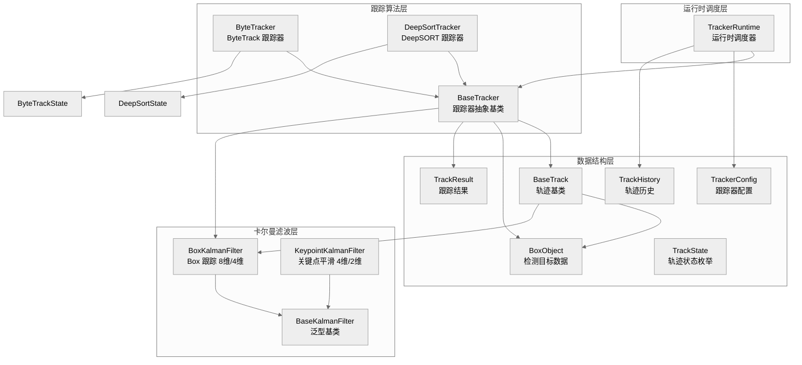
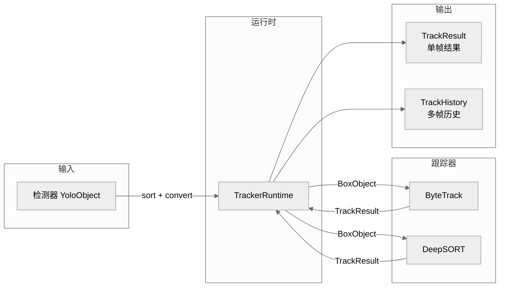
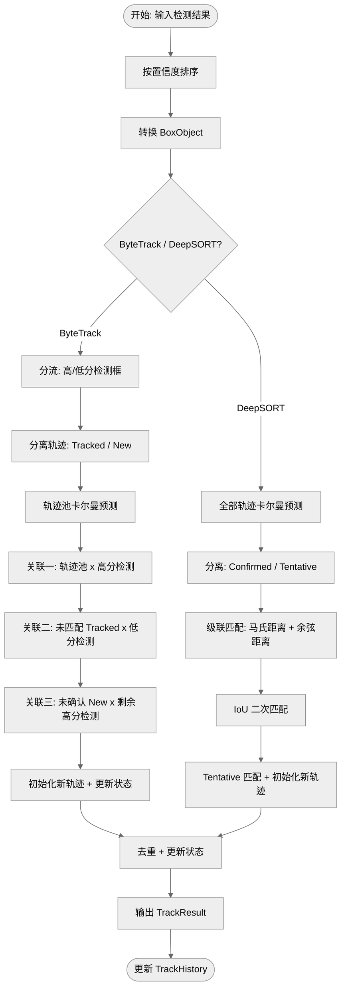
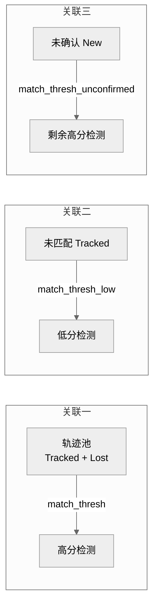

# Tracker 多目标跟踪模块

<!-- vscode-markdown-toc -->
- [Tracker 多目标跟踪模块](#tracker-多目标跟踪模块)
  - [模块概述](#模块概述)
    - [核心能力](#核心能力)
    - [文件组织](#文件组织)
  - [架构设计](#架构设计)
    - [数据流](#数据流)
    - [核心处理流程](#核心处理流程)
  - [核心调度](#核心调度)
  - [卡尔曼滤波](#卡尔曼滤波)
  - [数据结构](#数据结构)
  - [跟踪器实现](#跟踪器实现)
    - [ByteTrack](#bytetrack)
    - [DeepSORT](#deepsort)
  - [工具函数](#工具函数)

<!-- vscode-markdown-toc -->

## 模块概述

`tracker` 模块是 `visionAlgorithm` 项目的多目标跟踪 (MOT) 核心组件, 支持 **ByteTrack** 和 **DeepSORT** 两种主流跟踪算法。模块采用分层架构设计, 将卡尔曼滤波、数据关联、轨迹管理解耦为独立层次, 提供统一的运行时接口 `TrackerRuntime` 供上层应用调用。

### 核心能力

- **多算法支持**: 内置 ByteTrack 和 DeepSORT 跟踪器, 通过 INI 配置文件一键切换
- **鲁棒关联**: ByteTrack 的"高低分两次关联"策略, 显著提升遮挡场景跟踪鲁棒性
- **外观特征**: DeepSORT 支持 ReID 外观特征匹配, 实现跨帧身份保持
- **模板化卡尔曼**: 泛型卡尔曼滤波器基类, 支持 Box (8 维) 和 Keypoint (4 维) 两种状态空间
- **轨迹历史**: 自动维护每条轨迹的多帧历史记录, 支持客流量统计、行为分析等上层应用
- **边界框扩展**: 支持检测框扩展机制, 提高小目标跟踪稳定性

### 文件组织

```
lib/tracker/
├── BaseKalmanFilter.hpp        # 卡尔曼滤波器泛型基类 (模板参数: StateDim / MeasureDim)
├── BoxKalmanFilter.hpp         # Box 跟踪卡尔曼滤波器 (8 维 / 4 维)
├── KeypointKalmanFilter.hpp    # 关键点平滑卡尔曼滤波器 (4 维 / 2 维)
├── BaseTrack.hpp               # 轨迹基类 (ltwh / ltwh_expand 双轨存储)
├── BoxObject.hpp               # 检测目标数据结构 (跟踪器输入)
├── BaseTracker.hpp             # 跟踪器抽象基类
├── TrackResult.hpp             # 跟踪结果结构体 (跟踪器输出)
├── TrackState.hpp              # 轨迹状态枚举 (New / Tracked / Lost / Removed)
├── TrackHistory.hpp            # 轨迹历史记录 (客流量统计等上层应用)
├── TrackerConfig.hpp           # 跟踪器配置结构体 (枚举定义 + 配置参数)
├── TrackerRuntime.hpp          # 跟踪运行时调度器 (高级统一接口)
├── utils.hpp                   # INI 配置解析与工具函数
├── version.hpp                 # 版本信息查询
├── bytetrack/                  # ByteTrack 算法实现
│   ├── ByteTracker.hpp         #   ByteTrack 跟踪器 (三轮 IoU 关联)
│   ├── BytetrackTrack.hpp      #   ByteTrack 轨迹类
│   ├── matching.hpp            #   IoU 距离计算 + LAPJV 匈牙利匹配
│   └── lapjv.hpp               #   LAPJV 算法实现
└── deepsort/                   # DeepSORT 算法实现
    ├── DeepSortTracker.hpp     #   DeepSORT 跟踪器 (级联匹配)
    ├── DeepSortTrack.hpp       #   DeepSORT 轨迹类
    ├── matching.hpp            #   马氏距离 + 余弦距离 + 级联匹配
    ├── NNMetric.hpp            #   外观特征度量学习器
    └── hungarian.hpp           #   匈牙利算法实现
```

## 架构设计

模块采用分层架构, 从底层到上层依次为: **卡尔曼滤波层 → 数据结构层 → 跟踪算法层 → 运行时调度层**。



### 数据流



### 核心处理流程

每帧跟踪器 `update()` 的执行流程:



## 核心调度

- [TrackerRuntime 跟踪运行时调度器](TrackerRuntime.md) - 跟踪器统一调度入口, 封装 ByteTrack/DeepSORT, 提供统一高级接口

## 卡尔曼滤波

卡尔曼滤波器层采用模板化设计, 通过 C++ 模板参数在编译期决定状态空间与观测空间的维度, 完全消除动态内存分配。基类 `BaseKalmanFilter` 提供 `update` (卡尔曼更新) 和 `gating_distance` (马氏距离) 的通用默认实现, 子类只需实现 `initiate` / `predict` / `project` 三个纯虚接口。

| 类                                       | 状态维度 | 观测维度 | 状态空间                        | 说明                                        |
| ---------------------------------------- | -------- | -------- | ------------------------------- | ------------------------------------------- |
| `BaseKalmanFilter<StateDim, MeasureDim>` | 模板参数 | 模板参数 | 通用                            | 泛型基类, 提供通用 update / gating_distance |
| `KFBox` (BoxKalmanFilter)                | 8        | 4        | `[cx,cy,a,h,v_cx,v_cy,v_a,v_h]` | Box 跟踪恒定速度模型, 噪声与目标高度自适应  |
| `KFKeypoint` (KeypointKalmanFilter)      | 4        | 2        | `[x,y,v_x,v_y]`                 | 关键点 XY 坐标平滑, 固定/自适应双噪声模式   |

- [BaseKalmanFilter 卡尔曼滤波器泛型基类](BaseKalmanFilter.md) - 模板化卡尔曼滤波核心, 支持任意状态/观测维度
- [BoxKalmanFilter Box 跟踪卡尔曼滤波器](BoxKalmanFilter.md) - 8 维恒定速度模型, 适用于 SORT/ByteTrack/DeepSORT
- [KeypointKalmanFilter 关键点平滑卡尔曼滤波器](KeypointKalmanFilter.md) - 4 维恒定速度模型, 适用于姿态关键点平滑

## 数据结构

| 类/结构体       | 说明                                  | 关键成员                                                               |
| --------------- | ------------------------------------- | ---------------------------------------------------------------------- |
| `BaseTrack`     | 所有跟踪算法轨迹的公共基类            | `ltwh`(原始框), `ltwh_expand`(扩展框), `mean`/`covariance`(卡尔曼状态) |
| `BoxObject`     | 跟踪器输入检测目标 (`BaseTrack` 派生) | `conf`, `cls_conf`, `kpts`                                             |
| `TrackResult`   | 跟踪器输出结果 (单帧)                 | `track_id`, `det_index`, `x1/y1/x2/y2`                                 |
| `TrackHistory`  | 轨迹的历史帧记录 (多帧)               | `frames`(deque), `last_detection`(最新 YoloObject)                     |
| `TrackState`    | ByteTrack/DeepSORT 的轨迹状态枚举     | `New->Tracked->Lost->Removed` 或 `Tentative->Confirmed->Deleted`       |
| `TrackerConfig` | 跟踪器配置 (从 INI 加载)              | `tracker_type`, `track_thresh`, `max_age`, `n_init` 等                 |

- [BaseTrack 轨迹基类](BaseTrack.md) - 定义边界框双轨存储 (ltwh / ltwh_expand) 与卡尔曼状态管理
- [BoxObject 检测目标数据结构](BoxObject.md) - 跟踪器输入检测目标的统一数据结构
- [TrackResult 跟踪结果结构体](TrackResult.md) - 跟踪器输出结果的统一数据结构 (含 det_index 回溯机制)
- [TrackHistory 轨迹历史记录](TrackHistory.md) - 轨迹多帧历史记录, 支持客流量统计与行为分析
- [TrackState 轨迹状态枚举](TrackState.md) - 轨迹生命周期状态定义与状态机转换
- [TrackerConfig 跟踪器配置](TrackerConfig.md) - 跟踪器配置数据结构与枚举定义

## 跟踪器实现

### ByteTrack

ByteTrack 的核心创新在于利用低分检测框进行二次关联。传统跟踪器 (如 SORT) 只使用高置信度检测框进行关联, 低置信度检测框直接丢弃。ByteTrack 通过"三轮 IoU 匹配"策略利用所有检测框, 显著提升遮挡场景下的跟踪鲁棒性。

| 组件                                                         | 说明                                             |
| ------------------------------------------------------------ | ------------------------------------------------ |
| [ByteTracker ByteTrack 跟踪器](bytetrack/ByteTracker.md)     | 高低分检测框三轮 IoU 关联, 继承 BaseTracker      |
| [BytetrackTrack ByteTrack 轨迹](bytetrack/BytetrackTrack.md) | ByteTrack 轨迹类, 每个轨迹持有自己的 KFBox 副本  |
| [matching 匹配算法](bytetrack/matching.md)                   | IoU 距离计算, LAPJV 匈牙利匹配, 轨迹列表管理工具 |

**三轮 IoU 匹配设计**:



### DeepSORT

DeepSORT 在 SORT 的基础上增加了外观特征 (ReID) 的级联匹配策略, 优先匹配最近更新过的轨迹。使用马氏距离 (位置) + 余弦距离 (外观) 的加权融合距离, 在马氏距离超过卡方阈值时进行门控过滤。

| 组件                                                           | 说明                                            |
| -------------------------------------------------------------- | ----------------------------------------------- |
| [DeepSortTracker DeepSORT 跟踪器](deepsort/DeepSortTracker.md) | 级联匹配 + IoU 二次匹配, 继承 BaseTracker       |
| [DeepSortTrack DeepSORT 轨迹](deepsort/DeepSortTrack.md)       | DeepSORT 轨迹类, 共享全局 KFBox, 支持 ReID 特征 |
| [NNMetric 外观特征度量学习](deepsort/NNMetric.md)              | 余弦距离计算与最近邻匹配, 特征库增量维护        |
| [matching 匹配算法](deepsort/matching.md)                      | 级联匹配, 马氏距离门控, 融合距离矩阵计算        |

**ByteTrack vs DeepSORT**:

| 对比项     | ByteTrack                         | DeepSORT                          |
| ---------- | --------------------------------- | --------------------------------- |
| 匹配策略   | 三轮 IoU 关联                     | 级联匹配 + IoU 二次匹配           |
| 特征度量   | 仅位置 (IoU)                      | 位置 (马氏距离) + 外观 (余弦距离) |
| ReID 模型  | 不需要                            | 需要                              |
| 卡尔曼持有 | 每个轨迹持有副本                  | 共享全局 KFBox 对象               |
| 轨迹状态流 | New -> Tracked -> Lost -> Removed | Tentative -> Confirmed -> Deleted |
| 适用场景   | 通用场景, 速度快, 鲁棒性强        | 需要身份保持的遮挡场景            |

## 工具函数

- [utils 工具函数](utils.md) - INI 配置解析与跟踪器创建工厂
- [version 版本信息](version.md) - 版本号与编译信息查询
